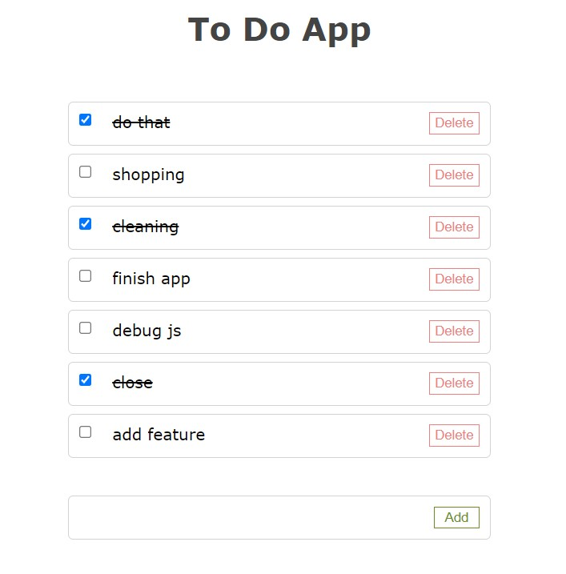

# zsgs-todoapp  
--> Used HTML, CSS and JavaScript to build frontend.  
--> Used java Servlet in backend to connect to MySQL database  
--> User axios XMLHttpRequest to connect to Servlet using GET, POST, DELETE, PATCH methods  
 
Features:  
--> Add todo text to list  
--> Change status  
--> Delete entry  
  
 ScreenShot:   
 
